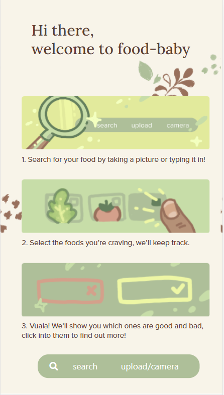
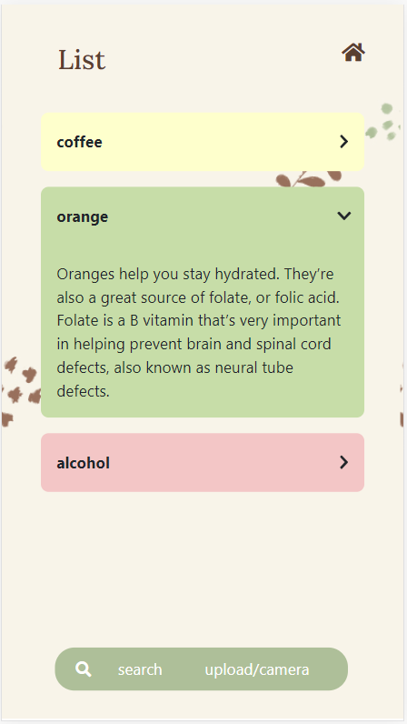
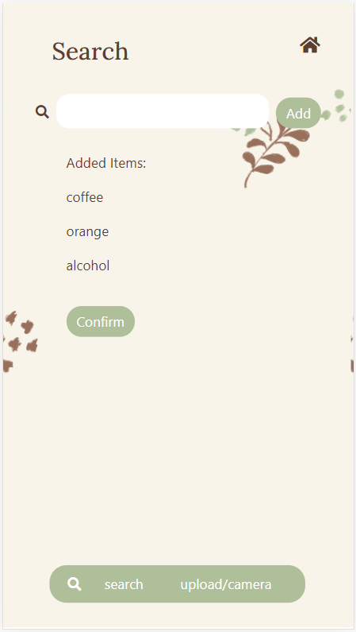

# Food Baby
A webapp that helps pregnant women identify foods that are good for their baby and foods to avoid during pregnancy. This project won the “Best Use of Google Cloud” award at the [Cmd-f 2021 Hackathon]( https://devpost.com/software/food-baby).

  

## :star: Introduction 
For the to-be-moms and expecting around the world, managing diet and knowing what is healthy can be stressful to manage. According to the [Journal of Physiology](https://academic.oup.com/ajcn/article/71/5/1218S/4729320), what a mother eats during pregnancy can have long-term effects on a child's health, if ill-managed, can link to later health problems like diabetes and cardiovascular disease. 

When researching this idea, we found a lot of mental well-being apps and baby heart-rate monitors, but (in the time we were given to research and ideate) couldn't find an app that really tackled the food and dietary concerns many moms have (although we are certain there are some out there). So we set off on a journey to collect data and use it for this purpose.

Our app is designed to make the lives of expecting moms a little easier, and give their babies a healthy meal. We hope it can reduce the amount of things they need to worry about as well as be a helping hand for those who want to learn more about food and how it affects their baby. We want to empower some of the strongest women we know in supporting their children and themselves.

## :sparkles: Features 

With Food Baby, pregnant women can easily access a database of foods information either through their phone or their computer’s web browser. Some specific features of our web-app include:

* Upload a photo of various food items and immediately receive results on the impact of shown food items on pregnancy
* Directly search for a food item through the search bar and receive information on it’s impact towards pregnancy
* Ability to view more nutritional details about each food, with information taken from articles and cross-checked sources
* Easy identification of food impact through a color-coded system (green being good for pregnancy, red being bad, yellow being neutral)

In the future, we hope to enlarge our database and perhaps even work with medical professionals to review and enhance our data.

## :wrench: How We Built It 
For the front-end, we used [React](https://reactjs.org/), [Bootstrap](https://getbootstrap.com/) and [Styled Components](https://styled-components.com/). In the back-end, we used [Node.js](https://nodejs.org/en/), and [Google Firebase](https://firebase.google.com/). To implement the ability of identifying multiple foods from photos, we used [Google Cloud's Vision API](https://cloud.google.com/vision). 

We also used [Figma](https://www.figma.com/) in our design process for the UI/UX. All graphics were hand drawn and the icons were sourced from [Flaticon](https://www.flaticon.com/).

